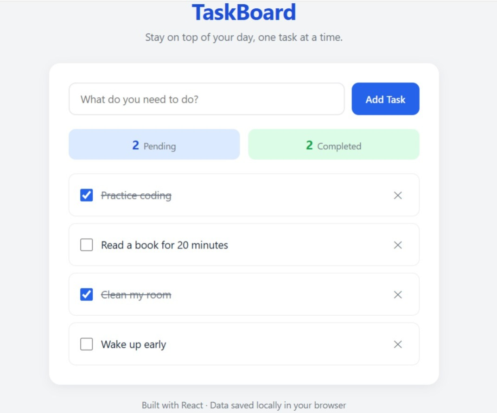

# ✅ TaskBoard — React To-Do Application




🚀 **Project Type:** Frontend Developer Internship Portfolio Project

A modern and responsive **React-based To-Do application** developed to demonstrate core frontend development skills including **component-based architecture, state management, responsive UI design, and client-side data persistence**.

TaskBoard allows users to create, manage, complete, and delete daily tasks while automatically saving task data using the browser's **Local Storage API**, ensuring tasks remain available even after refreshing or reopening the application.
<<<<<<< HEAD

---

# 👩‍💻 About The Project

**TaskBoard** was developed as an internship portfolio project to showcase practical React development skills expected from an entry-level frontend developer.

The project focuses on:

* **Reusable React components**
* **Clean folder architecture**
* **Global state management using Context API**
* **Responsive user interface design**
* **Local Storage based data persistence**

The application follows a modular structure where each component has a specific responsibility, making the codebase easier to maintain and extend.

---

# 🚀 Project Objectives

The main objectives of this project were:

* Build a functional **Single Page Application** using React
* Practice React functional components and hooks
* Implement global state management using **Context API**
* Create reusable and maintainable components
* Design a professional responsive interface
* Store application data without requiring a backend server

---

# ✨ Features

* Add new tasks through validated input
* Mark tasks as completed or incomplete
* Delete individual tasks
* Live pending and completed task counters
* Empty-state message when no tasks exist
* Automatic task persistence using **Local Storage**
* Responsive design for mobile, tablet, and desktop
* Modern card-based UI with smooth hover interactions

---

# 🛠️ Technologies Used

## Frontend Development

* **React 18**
* **Vite**
* **JavaScript (ES6+)**
* **CSS3**

## State Management

* **React Context API**

## Browser Features

* **Local Storage API**

## Development Tools

* **Visual Studio Code**
* **Git**
* **GitHub**

---

# 📂 Project Structure

```text
react-todo-app/

│
├── public/
│
├── src/
│   │
│   ├── components/
│   │   ├── TaskInput.jsx
│   │   ├── TaskItem.jsx
│   │   └── TaskList.jsx
│   │
│   ├── context/
│   │   └── TaskContext.jsx
│   │
│   ├── styles/
│   │   ├── App.css
│   │   └── index.css
│   │
│   ├── App.jsx
│   └── main.jsx
│
├── package.json
├── vite.config.js
└── README.md
```

---

# 🏗️ Application Architecture

The application follows a modular React component architecture:

## TaskContext.jsx

Responsible for:

* Managing global task state
* Providing add, delete, and toggle functions
* Tracking pending and completed task counts

## TaskInput.jsx

Responsible for:

* Capturing new task input
* Validating user entries
* Adding new tasks

## TaskList.jsx

Responsible for:

* Rendering task collection
* Displaying empty-state messages

## TaskItem.jsx

Responsible for:

* Displaying individual tasks
* Handling completion checkbox
* Providing delete functionality

This structure keeps state management centralized while maintaining reusable and focused components.

---

# ⚙️ Installation & Setup

To run this project locally:

## Clone Repository

```bash
git clone https://github.com/ammarahumer/react-todo-app.git
```

## Navigate To Project Folder

```bash
cd react-todo-app
```

## Install Dependencies

```bash
npm install
```

## Run Development Server

```bash
npm run dev
```

Open the local development URL in your browser.

---

# 🎯 Challenges Faced

During development, the following challenges were addressed:

* Synchronizing React state with Local Storage efficiently using the **useEffect hook**.
* Designing a professional UI instead of a basic beginner-level interface.
* Maintaining usability across different screen sizes through responsive design techniques.

---

# 🔮 Future Improvements

Planned improvements:

* Add task categories and due dates
* Implement drag-and-drop task reordering
* Add inline task editing
* Introduce dark mode support
* Connect with backend API for multi-device synchronization

---

# 👩‍💻 Author

**Ammarah Umer**

**Bachelor of Science in Computer Science (BSCS) Student**  
**Iqra University — Airport Campus, Karachi**

Interested in:

* **Frontend Development**
* **Software Engineering**
* **Artificial Intelligence**
* **Building scalable software solutions**

---

# 🔗 Connect With Me

- **GitHub:** https://github.com/ammarahumer

- **LinkedIn:** https://linkedin.com/in/ammarahumer
=======

---

## 👩‍💻 About The Project

TaskBoard was developed as an internship portfolio project to showcase practical React development skills expected from an entry-level frontend developer.

The project focuses on:

* Reusable React components
* Clean folder architecture
* Global state management using Context API
* Responsive user interface design
* Local Storage based data persistence

The application follows a modular structure where each component has a specific responsibility, making the codebase easier to maintain and extend.

---

## 🚀 Project Objectives

The main objectives of this project were:

* Build a functional Single Page Application using React
* Practice React functional components and hooks
* Implement global state management using Context API
* Create reusable and maintainable components
* Design a professional responsive interface
* Store application data without requiring a backend server

---

## ✨ Features

* Add new tasks through validated input
* Mark tasks as completed or incomplete
* Delete individual tasks
* Live pending and completed task counters
* Empty-state message when no tasks exist
* Automatic task persistence using Local Storage
* Responsive design for mobile, tablet, and desktop
* Modern card-based UI with smooth hover interactions

---

## 🛠️ Technologies Used

### Frontend Development

* React 18
* Vite
* JavaScript (ES6+)
* CSS3

### State Management

* React Context API

### Browser Features

* Local Storage API

### Development Tools

* Visual Studio Code
* Git
* GitHub

---

## 📂 Project Structure

```text
react-todo-app/

│
├── public/
│
├── src/
│   │
│   ├── components/
│   │   ├── TaskInput.jsx
│   │   ├── TaskItem.jsx
│   │   └── TaskList.jsx
│   │
│   ├── context/
│   │   └── TaskContext.jsx
│   │
│   ├── styles/
│   │   ├── App.css
│   │   └── index.css
│   │
│   ├── App.jsx
│   └── main.jsx
│
├── package.json
├── vite.config.js
└── README.md
>>>>>>> 8556925 (Add project preview image and update README)
